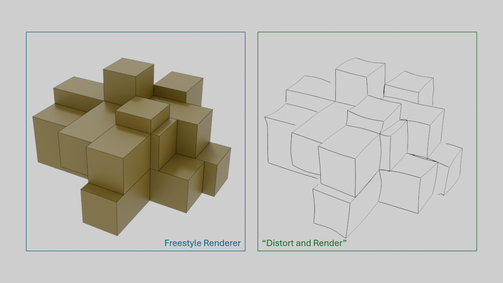

# shuyuan-coder

A model specialised in coding. The following is a list of projects built with(by) it.

## 💻 Projects

**[Markdown with Variables](https://github.com/SanBingYouYong/markdown_variabled)**, custom markdown parser/syntax for inserting variables like Python format strings.

**[Bigram-based Phrase](https://github.com/SanBingYouYong/BigramBased-PhraseGeneration) / [Poetic Name Generator](https://github.com/SanBingYouYong/Person-Name-Generator)** and a **[Stellaris namelist mod](https://steamcommunity.com/sharedfiles/filedetails/?id=2936448779)**, with over 500 subscribers overall.

**[Distortion Renderer](https://github.com/SanBingYouYong/distortion-renderer)**, a custom Blender add-on that distorts an object’s edges and renders with Freestyle to create a sketch-like image, extracted from `BSc Dissertation`.

**[PDF Notes Search](https://github.com/SanBingYouYong/notes_search)**, PDF and OCR-based notes hierarchical search.

