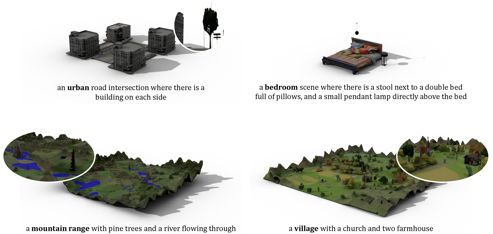
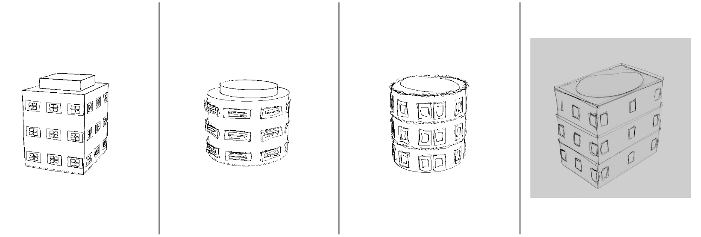
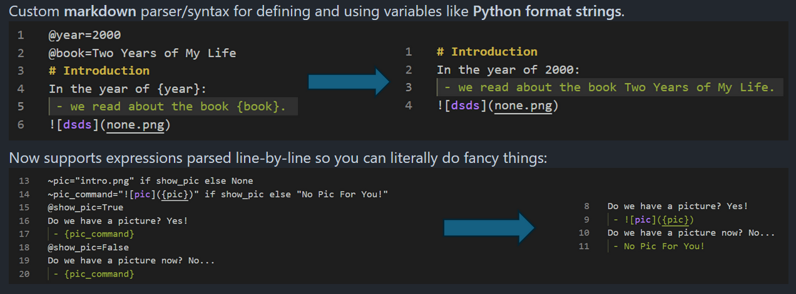
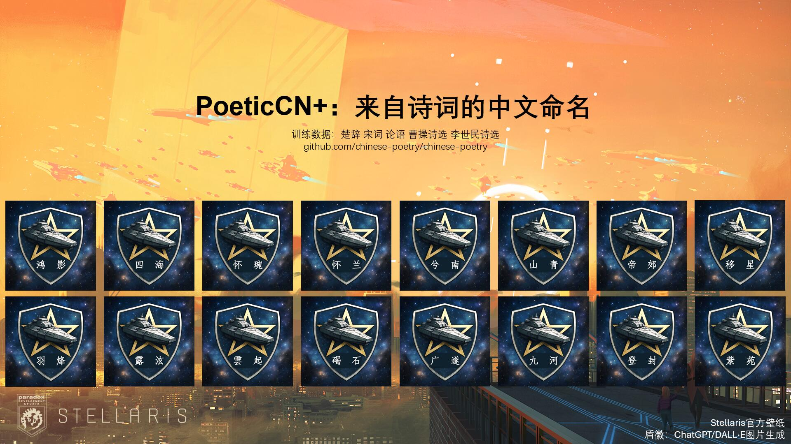
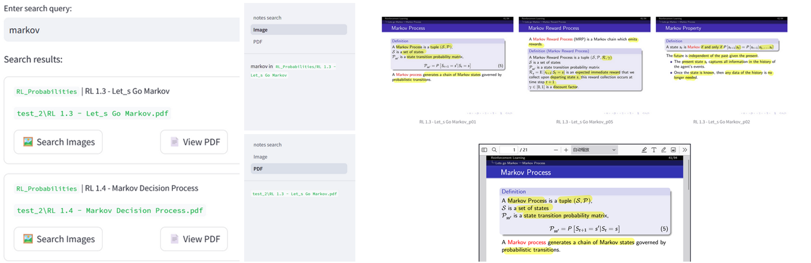

# Model Summary

A Natural General Intelligence model specialised in **research topics** from 3D generation, LLM agents to the broader computer graphics, computer vision and natural language processing fields. 

## 🎓 Academic Pre-training

- **Imperial College London**
    - `type`: [MSc in Advanced Computing](https://www.imperial.ac.uk/study/courses/postgraduate-taught/advanced-computing/)
    - `knowledge cutoff`: 2024 - (2025)

- **The University of Edinburgh**
    - `type`: [BSc Computer Science](https://study.ed.ac.uk/programmes/undergraduate/57-computer-science), First-class
    - `supplementary tasks`: Tutoring, Student Representative, Summer Research Internship
    - `knowledge cutoff`: 2020 - 2024

## 🖊️ Release History

**[ShapeCraft: LLM Agents for Structured, Textured and Interactive 3D Modeling](pages/shapecraft.html)**, *Shuyuan Zhang*, Chenhan Jiang, Zuoou Li, and Jiankang Deng, `NeurIPS 2025`

**Towards Unified, Structured and LLM-native 3D Scene Synthesis**, `MSc Thesis`

[**Inverse Procedural Modeling: From Sketches to Buildings**](https://project-archive.inf.ed.ac.uk/ug4/20244373/ug4_proj.pdf), `BSc Thesis`

## 🧰 Additional Fine-tuning

- **Software Infrastructure for Driverless Vehicle**
    - `venue`: [Edinburgh University Formula Students](https://www.eufs.co/)
    - `topics`: Command Line Interface, Backend
    - `knowledge cutoff`: 2023 - 2024

- **Assorted Summer Internships**
    - `topics`: Digital Human, LLM Agents, Computer Vision

## 📰 Example Model Output

**[Markdown with Variables](https://github.com/SanBingYouYong/markdown_variabled)**, custom markdown parser/syntax for inserting variables like Python format strings.

**[Bigram-based Phrase](https://github.com/SanBingYouYong/BigramBased-PhraseGeneration) / [Poetic Name Generator](https://github.com/SanBingYouYong/Person-Name-Generator)** and a **[Stellaris namelist mod](https://steamcommunity.com/sharedfiles/filedetails/?id=2936448779)**, with over 500 subscribers overall.

**[Distortion Renderer](https://github.com/SanBingYouYong/distortion-renderer)**, a custom Blender add-on that distorts an object’s edges and renders with Freestyle to create a sketch-like image, extracted from `BSc Thesis`.

**[PDF Notes Search](https://github.com/SanBingYouYong/notes_search)**, PDF and OCR-based notes hierarchical search.

