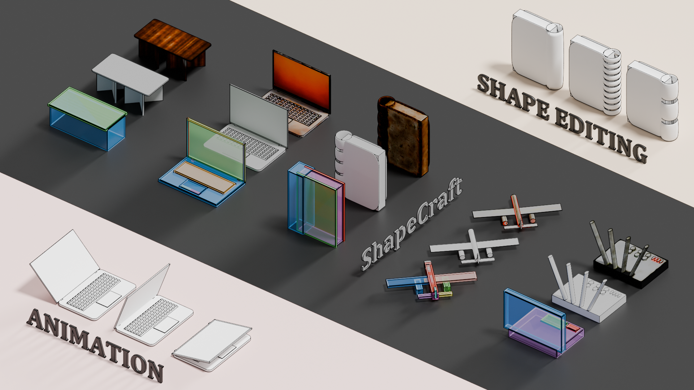

# Model Summary

<!-- 
A Natural General Intelligence model specialised in research topics ranging from 3D generation, LLM agents to the broader computer graphics, computer vision and natural language processing fields. Reach out to me via <a href="mailto:rayzhang707+contact@gmail.com">rayzhang707+contact@gmail.com</a> <small><small>Photo stylized by Nano Banana</small></small>
 -->

<!-- A Natural General Intelligence model specialised in research topics ranging from **3D generation**, **LLM agents** to the broader *computer graphics*, *computer vision* and *natural language processing* fields. <small><small>Photo stylized by Nano Banana</small></small> -->

    A Natural General Intelligence model specialised in research topics ranging from 
    3D generation, 
    LLM agents to the broader 
    computer graphics, 
    computer vision and 
    natural language processing fields. 
    <small>Contact: <a href="mailto:rayzhang707+ext@gmail.com">rayzhang707+ext@gmail.com</a></small>
     <small><small>Photo stylized by Nano Banana</small></small>

<!-- <figure markdown="span">
  { width="150" }
  <figcaption>Me at White Cliffs</figcaption>
</figure> -->

## 🎓 Academic Pre-training

- **Imperial College London**
    - `type`: [MSc in Advanced Computing](https://www.imperial.ac.uk/study/courses/postgraduate-taught/advanced-computing/), Distinction
    - `knowledge cutoff`: 2024 - 2025

- **The University of Edinburgh**
    - `type`: [BSc Computer Science](https://study.ed.ac.uk/programmes/undergraduate/57-computer-science), First-class
    - `supplementary tasks`: Tutoring, Student Representative, Summer Research Internship
    - `knowledge cutoff`: 2020 - 2024

## 🖊️ Release History

<small>* denotes equal contribution</small>

**[ShapeCraft: LLM Agents for Structured, Textured and Interactive 3D Modeling](shapecraft/index.html)**, <u>Shuyuan Zhang</u>\*, Chenhan Jiang\*, Zuoou Li, and Jiankang Deng, `NeurIPS 2025`

**Towards Unified, Structured and LLM-native 3D Scene Synthesis**, `MSc Dissertation`

[**Inverse Procedural Modeling: From Sketches to Buildings**](https://project-archive.inf.ed.ac.uk/ug4/20244373/ug4_proj.pdf), `BSc Dissertation`

## 🧰 Additional Fine-tuning

- **Software Infrastructure for Driverless Vehicle**
    - `venue`: [Edinburgh University Formula Students](https://www.eufs.co/)
    - `topics`: Command Line Interface, Backend
    - `knowledge cutoff`: 2023 - 2024

- **Assorted Summer Internships**
    - `topics`: Digital Human, LLM Agents, Computer Vision
