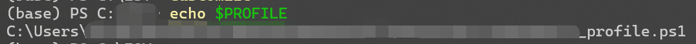
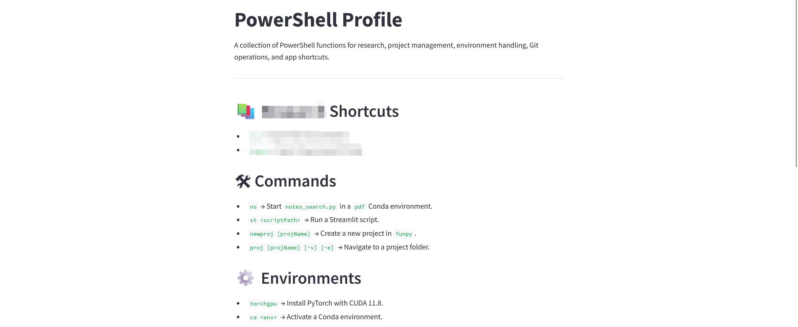

# Windows Terminal bashrc-like Customization

- Use `echo $PROFILE` to check which `profile.ps1` file your Windows Terminal is using.

    

- Allow locally written scripts by searching for the keyword: remote signed.
- Use `. $PROFILE` to apply your changes like `source ~/.bashrc`, or restart the terminal.
- Define constants (`export xxx=xxxxxx`): `Set-Variable -Name “xxx” -Value “xxxxxxx” -Option Constant`
    - You can then use them with `$xxx`.
    - Or directly use `$xxx = xxxxxx`.
- Define functions (`alias f="xxxx"`): `function f { xxxx }`
    - The big models do this better than you.
    - For example:
        - Quickly open your magical tools library:
            ```powershell
            function proj {
                param (
                    [string]$projName,
                    [switch]$vscode,
                    [switch]$explorer
                )

                if ($projName) {
                    $projPath = Join-Path -Path $funpy -ChildPath $projName
                    if (Test-Path $projPath) {
                        Set-Location $projPath
                        if ($explorer) {
                            explorer.exe .
                        }
                        if ($vscode -or -not $explorer) {
                            code .
                        }
                    } else {
                        Write-Error "The project '$projName' does not exist."
                    }
                } else {
                    Get-ChildItem -Path $funpy -Directory | ForEach-Object { $_.Name }
                }
            }
            ```

- Nice, but what if I forgor? 
    - [https://stackoverflow.com/questions/15694338/how-to-get-a-list-of-custom-powershell-functions](https://stackoverflow.com/questions/15694338/how-to-get-a-list-of-custom-powershell-functions):

        ```powershell
        # get custom functions
        $sysfunctions = Get-ChildItem function:
        function custom {Get-ChildItem function: | Where-Object {$sysfunctions -notcontains $_} }
        ```

- If you would like to be more *elegante~*
    - Write or have a big model help generate a `profile.ps1` document, such as `readme.md`.
    - Install [streamlit](https://streamlit.io/) in your local Python environment.
    - Write the following simple streamlit webpage to read and display the markdown.

        ```python
        import streamlit as st
        import os
        import subprocess

        # Set the page configuration to use the wide layout
        st.set_page_config(layout="centered")

        # Retrieve the profilePath variable from PowerShell
        # Make sure you have defined the profilePath variable in your environment or profile.ps1, which is the folder where your $PROFILE resides.
        profile_path = subprocess.check_output(['powershell', '-Command', '(Get-Variable -Name profilePath).Value'], text=True).strip()

        doc_path = os.path.join(profile_path, 'readme.md')

        with open(doc_path, 'r', encoding='utf-8') as file:
            readme_content = file.read()

        st.markdown(readme_content)
        ```

    - Also, define a simple function to replace manual commands.

        ```powershell
        function doc {
            $doc_py_path = Join-Path -Path $profilePath -ChildPath "doc.py"
            streamlit run $doc_py_path
        }
        ```

- Now, you can simply type `doc` in the command line to get:


