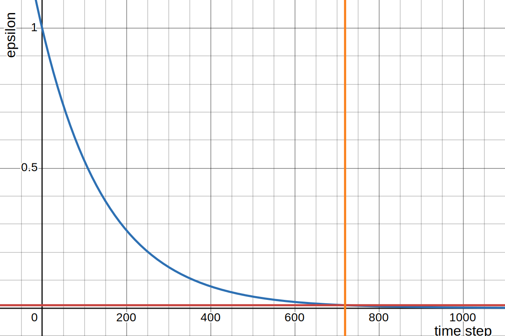

# A Decay Function for Exploration-Exploitation Handling in Reinforcement Learning

In the context of reinforment learning, we wish to set up a $\epsilon$-greedy policy to allow for some exploration at the start, and exponential decay of $\epsilon$ meets the Greedy-in-the-Limit & Infinite Exploration requirement for exploratory methods.

In practice, we often find the need to precisely define when does the major exploratory period ends and by what threshold, to put it in another way, we want to let $\epsilon$ to decay to a threshold $a$ after $b$ time steps.

A usual exponential decay functions takes the form $\epsilon=e^{-kt}$ where $k$ is a constant controling the decay and $t$ is the current time step. We carry out some manual experiment and find out $\epsilon=e^{-\frac{1}{3ab}t}$ apprxoimates our requirements. We generalize this form to find an exact solution for some constant that replaces the $\frac{1}{3}$: $\epsilon=e^{-\frac{c}{ab}t}$.

Solving for $e^{-\frac{c}{ab}t} = a$ yields $c=-a\ln{a}$, and inserting it back we end up with **$\epsilon=e^{\frac{\ln{a}}{b}t}$**, where $a$ is the decay target (e.g. 0.1) at time step $b$ (e.g. after 50 steps), and $t$ the time step. Note that we removed the $k$ parameter to control the decay since even if we added it, it's gonna cancel itself out - makes sense intuitively if we already control the decay with a set point (b, a). However, it is possible to define a more complex or a piece-wise decay function that allows control over decay speed before (and/or) after the thresholding point.

Blue line is the decay function, with red and orange lines' intersection showing (b, a)

To check it on [desmos](https://www.desmos.com/calculator/mzq8mrjyj3).
