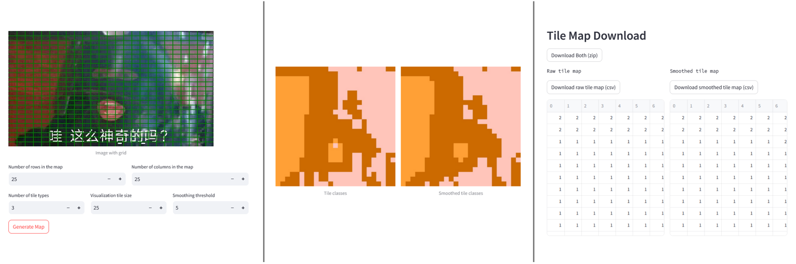

# Highlight Git Repos

## Tools & Toys
- [**markdown_variabled**](https://github.com/SanBingYouYong/markdown_variabled)
    - *Custom markdown parser/syntax for inserting variables like Python format strings.*
    - ever felt like inserting variables into your text like `f"{this}"`? 
    - latex is too heavy and other tools aren't dominating, so
    
- [**image2map**](https://github.com/SanBingYouYong/Image2Map)
    - *Convert any image to tile map in csv format that can be easily adapted as a map for tile-based game. Based on color similarity and knn in Lab color space.*
    - originally part of an Unity game project, now re-implemented in Python and available as a webpage through streamlit
    - the project is also directly hosted [here](https://image2map.streamlit.app/) on streamlit ~~if you are not willing to clone my repo~~
    - streamlit is easy to use and you should learn it today
    

## NLP at home
- [**person_name_generator**](https://github.com/SanBingYouYong/Person-Name-Generator) and [**bigram_based_phrase_generation**](https://github.com/SanBingYouYong/BigramBased-PhraseGeneration)
    - a Chinese-style person name generator and its *algorithmic* core: bigram probablities from a Chinese poetry dataset. (see `Contributed to` section below)
    - data generated later became part of the [Stellaris name list mod](https://steamcommunity.com/sharedfiles/filedetails/?id=2936448779) with 500+ subs.
    - example Chinese names generated from Songci: 
        > 崔绣巾 廉北寒 富山红 司空多欢 傅榴垂 罗秋落 沈楼零 谷华一 西门郎间 纪非桃 习人青 符零何 郏鸯易 傅条向 师等潇 西门一香 令狐华烟 宋何共

## Blender
- [**distortion_renderer**](https://github.com/SanBingYouYong/distortion-renderer)
    - *A Blender custom add-on that distorts an object's edges and renders with Freestyle to create a sketch-like image.*
    - originally part of my dissertation (to generate sketches for training), now refactored into a standalone Blender add-on.
    
- [**auto_renderer**](https://github.com/SanBingYouYong/Blender-Auto-Renderer)
    - *Automatically renders your collections one by one, with proper side views.*
    - to quickly render a set of 3D models into 2D views (and with some postprocessing, to become stylized 2D icons), [tutorial](https://www.bilibili.com/video/BV1dV4y1679x) on bilibili available (no English subtitles), original purpose is to help game mod devs to obtain icon assets easily. 
    

## Dissertation
- [**BuildingDAG24**](https://github.com/SanBingYouYong/BuildingDAG24)
    - Dissertation code base for Inverse Procedural Modeling: From Sketches to Buildings, if you wish to check it out.

## Contributed to
- [**chinese_poetry**](https://github.com/chinese-poetry/chinese-poetry)
    - *The most comprehensive database of Chinese poetry.*
    - provided a standard data loader
