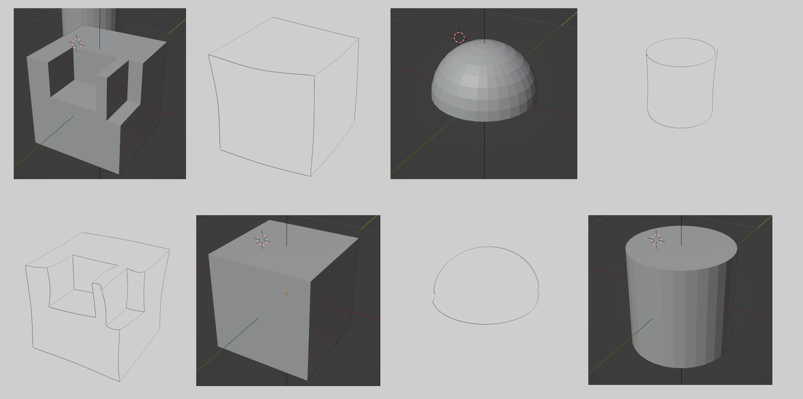
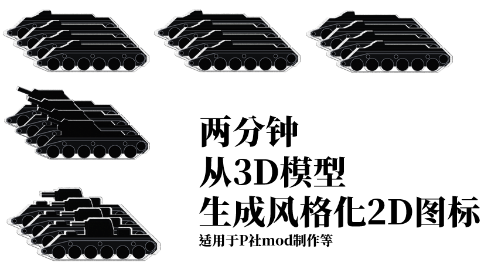

# GitHub代码库

## 工具/小玩具

- [markdown_variabled](https://github.com/SanBingYouYong/markdown_variabled)
  - *自定义Markdown解析器/语法，用于插入类似Python格式字符串的变量。*
  - 是否曾想过在文本中插入变量，如`f"{变量}"`？
  - LaTeX太过臃肿，其他工具不够主流，所以……
    
- [image2map](https://github.com/SanBingYouYong/Image2Map)
  - *将任何图片转换为csv格式的地块地图，可作为基于地块/格子的游戏地图。基于Lab颜色空间中的颜色相似性和knn算法。*
  - 原本是一个Unity游戏项目的一部分，现在用Python重新实现，并通过Streamlit提供网页界面
  - 该项目也直接在Streamlit上部署于[这里](https://image2map.streamlit.app/)~~如果你不愿意克隆我的代码库~~
  - Streamlit非常易于使用，你今天就应该开始学习并上手
    

## 简单的自然语言处理应用

- [person_name_generator](https://github.com/SanBingYouYong/Person-Name-Generator) 和 [hbigram_based_phrase_generation](https://github.com/SanBingYouYong/BigramBased-PhraseGeneration)
  - 一个中国风的名字生成器及其*算法*核心：基于中文诗歌数据集的bigram概率模型。（参见下文“贡献于”部分）
  - 后来生成的数据成为[Stellaris名字列表mod"PoeticCN"](https://steamcommunity.com/sharedfiles/filedetails/?id=2936448779)的一部分，拥有500+订阅。
  - 根据宋词生成的示例中文名字：
        > 崔绣巾 廉北寒 富山红 司空多欢 傅榴垂 罗秋落 沈楼零 谷华一 西门郎间 纪非桃 习人青 符零何 郏鸯易 傅条向 师等潇 西门一香 令狐华烟 宋何共

## Blender

- [distortion_renderer](https://github.com/SanBingYouYong/distortion-renderer)
  - *一个Blender自定义插件，可扰动3D模型的边并使用Freestyle渲染生成类似手绘的图片(实际上你也可以接着使用其生成的贝塞尔曲线)。*
  - 最初是我毕设的一部分（用于生成训练草图），现已重构为一个独立的Blender插件。
    
- [auto_renderer](https://github.com/SanBingYouYong/Blender-Auto-Renderer)
  - *自动渲染Blender collections，一个接一个，并带有适当的侧视图。*
  - 快速将一组在同一个collection里的3D模型渲染为2D视图（加上一些后处理，变成风格化的2D图标），[教程](https://www.bilibili.com/video/BV1dV4y1679x)在哔哩哔哩上可用，最初目的是帮助游戏mod开发者轻松获取图标素材。
    

## 毕业论文

- [BuildingDAG24](https://github.com/SanBingYouYong/BuildingDAG24)
  - 逆向程序化建模：从手绘到建筑的论文代码库，欢迎查阅。

## 贡献于

- [chinese_poetry](https://github.com/chinese-poetry/chinese-poetry)
  - *最全面的中文诗歌数据库。*
  - 提供了一个标准的数据加载器
