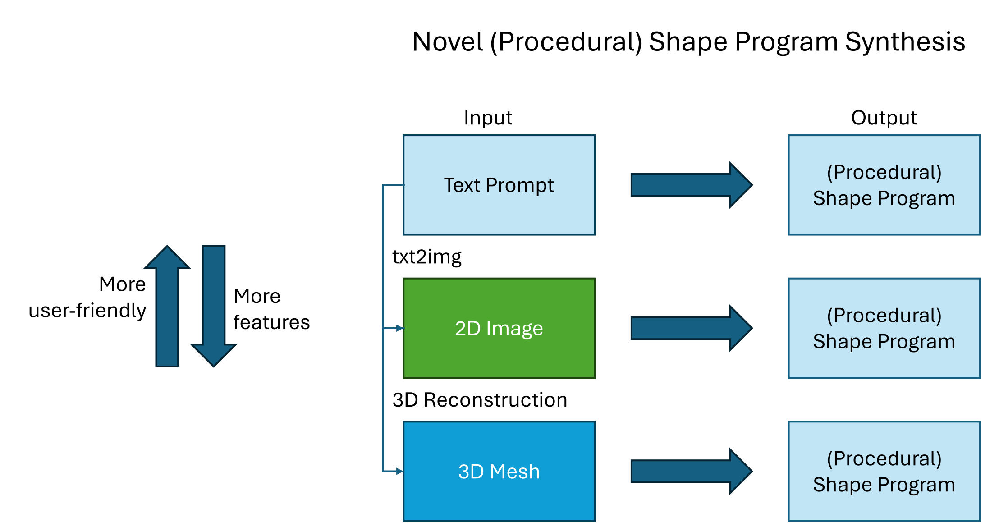
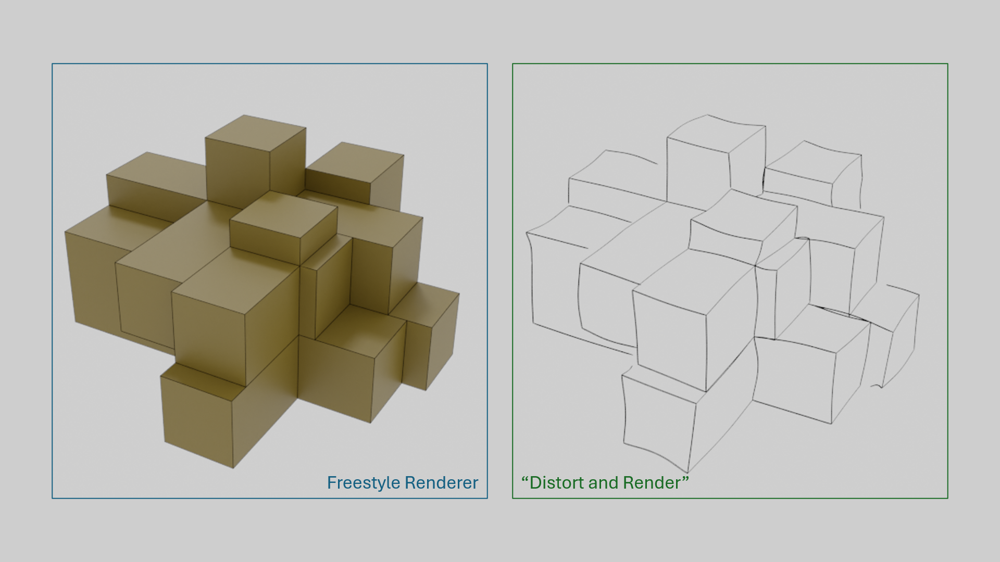
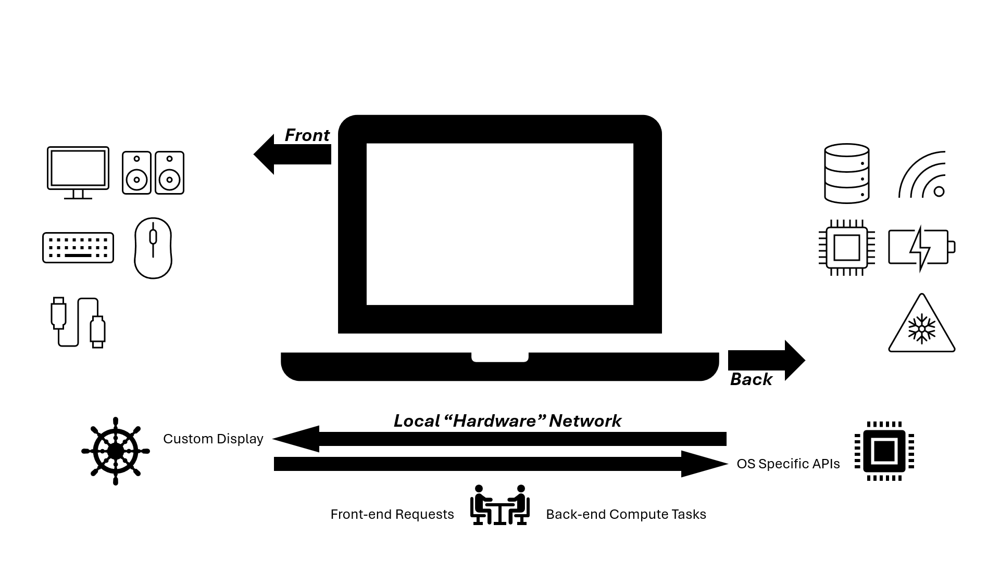

# Thoughts & Notes

## [On novel shape program synthesis](proposal_proc_sp_gen.html)

## [On perturbing a mesh](thoughts_perturbing_mesh.html)

## [On personal assistants based on LLMs](plans_personal_assistant.html)

## [On decay functions for exploratory reinforcement learning](notes_rl_e_decay.html)

## [On decoupling personal compute](thoughts_laptop_divide.html)

