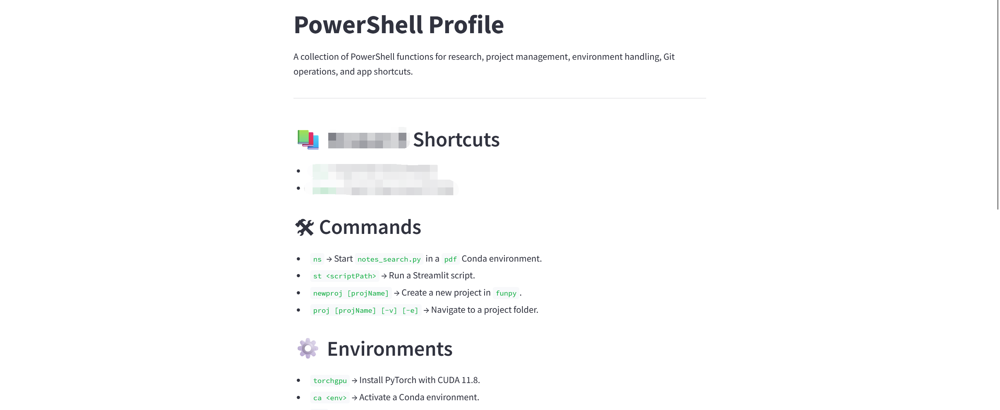
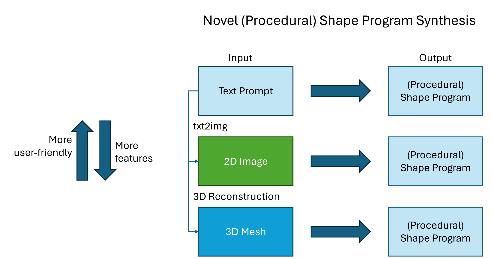
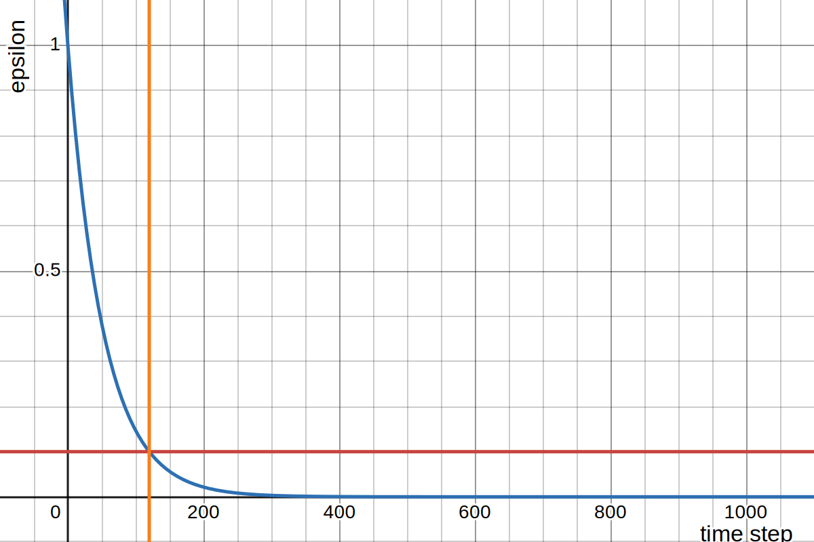

# 想法与笔记

## [Bashrc但是Windows Terminal](notes_bashrc_in_powershell.md)

## [(en)有关程式化模型程序生成](proposal_proc_sp_gen.html)

## [(en)有关扰动3D模型](thoughts_perturbing_mesh.html)

## [(en)有关实用LLM个人助理](plans_personal_assistant.html)

## [(en)有关强化学习中的Decay Function](notes_rl_e_decay.html)

