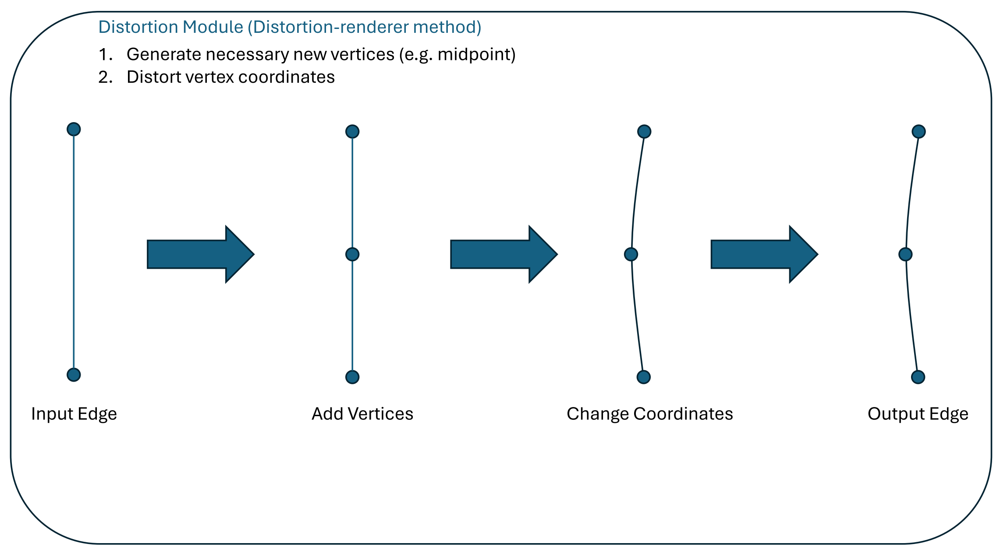
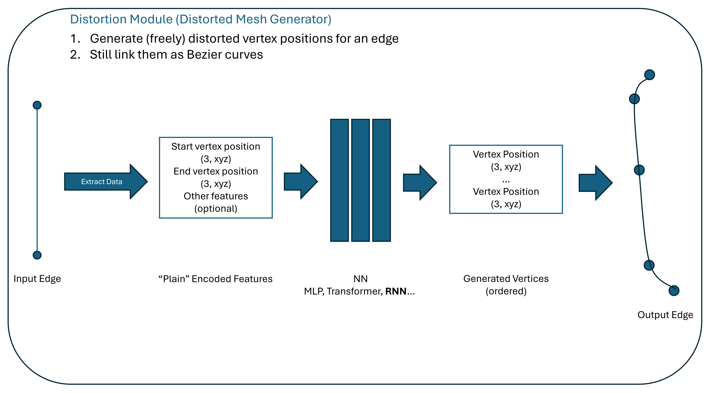
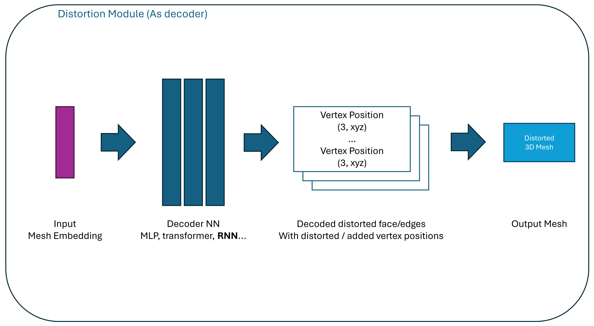

# Perturbing a Mesh
Mesh perturbance is a common technique in the field of 3D shape processing, and it is often used in the context of data augmentation, adversarial attacks, and shape retrieval. In our interest we look at edge-based perturbances (for sketch-based applications).

## Perturbation on Edges
In [distortion_renderer](https://github.com/SanBingYouYong/distortion-renderer), the mesh perturbation is based on identifying a set of feature edges, converting them to bezier curves and adding/changing the control points of the curves. 

An intuitive extension is to vary the number of control points, or more radically, to introduce neural networks to generate a new set of control points. Fully-connected layers, RNNs or transformers are all good candidates for such a task: given a set of control points (i.e. two vertex coordinates), the network can predict a new set of control points along a slightly different curve and optionally decides the control point density distributionwhen or when to stop (as in, outputting a list of control point coordinates). These generated coordinates can again be used to construct a new bezier curve, and the process can be repeated for all feature edges.

Why limit the input to be such a plain encoding of edge features? Use any mesh encoder networks to encode the mesh into a feature vector, and use this feature vector as the input to the perturbation network. This way, the perturbation network can learn to generate control points that are more meaningful to the input mesh, and the perturbation can be controlled with increased flexibility.

